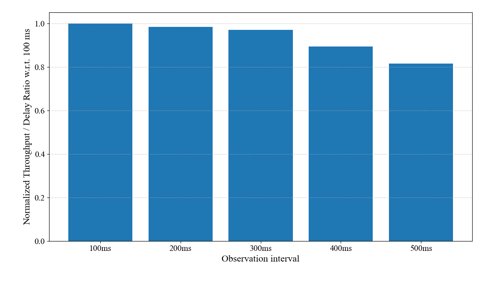

# 不同觀察週期下的吞吐量及延遲表現
隨著觀察週期增加，系統吞吐量呈現上升的趨勢，但隨著觀察週期拉長，吞吐量的上升幅度開始趨於平緩。另一方面，存取延遲也會隨著觀察週期增加而逐漸上升，隨著觀察週期拉長，存取延遲上升的幅度會逐漸增加。

# 不同觀察週期下的吞吐量增益與存取延遲增加變化
隨著觀察間隔的增加，單位存取延遲所換取的吞吐量呈現遞減趨勢，當觀察週期超過300 ms後，其下降幅度更明顯。

